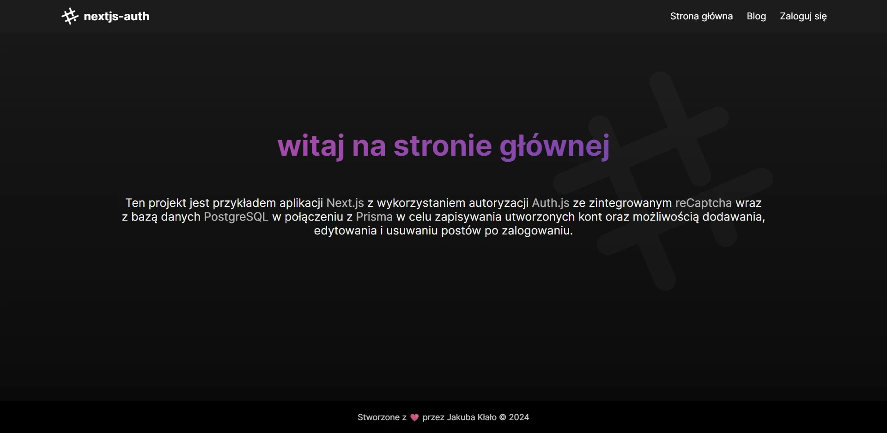

<h1>nextjs-auth</h1>

###

<div>
  
  
  
  
  
  
  
  
  
  
  
  
  
</div>

###

<p>Fullstack blog application created using Next.js v14 framework with connection to PostgreSQL Database using Prisma for user login/register server account authentication.</p>

###

<div>
  
</div>

###

- Using [Next.js](https://nextjs.org/docs) framework with App Router ( /app )
- Build by [pnpm](https://pnpm.io/) package manager

###

## At first run:

Create new `.env` file and fill it in according to [example template](./example.env).

Install all packages and required dependencies:

```
pnpm install
```

migrate prisma database:

```
pnpm exec prisma migrate dev
```

generate new prisma client:

```
pnpm exec prisma generate
```

run whole project as dev:

```
pnpm dev
```

in every change in database and prisma scheme run:

```
pnpm exec prisma db push
```

## Features:

- dynamically updating database content in real time
- register and login forms with client and server validation
- toast responsive prompts
- adding, editing and deleting posts on blog page with saving to database
- dedicated profile page for changing password, deleting account or log out from session
- view of all of user posts and comments

## Support:
<a href="https://ko-fi.com/quanosek">
    
</a>
